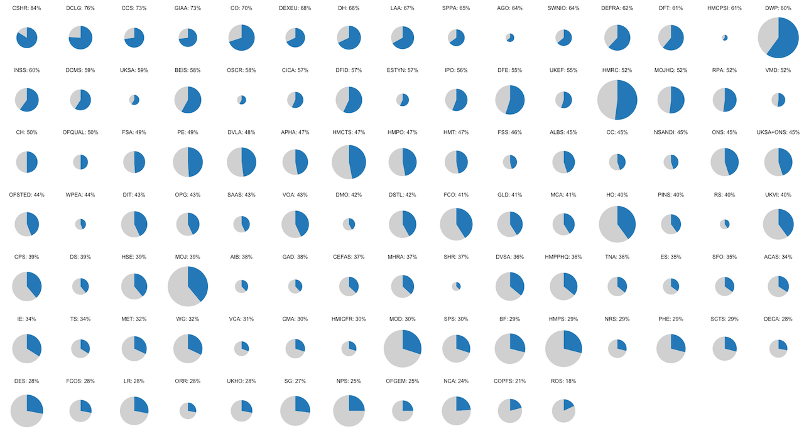

# CSPS MultiPie
A set of functions to create a field of multiple pie charts (a "MultiPie") of results from the Civil Service People Survey. Each _MultiPie_ shows the scores of one metric from the People Survey split across different categories of a group, with the size of individual pie charts being quasi-proportionate to a given size variable. The main use is to show the scores of different organisations while also demonstrating variable headcount across organisations.

*This is a work in progress, there may be errors.*

_MultiPies_ need two datasets (in CSV format), both of which must have a key variable of the categories (e.g. organisations) that you want to produce individual pie charts for:

* "Headcount" data - to vary the size of the pie charts
* "Scores" data - the People Survey results you want to visualise

Using this data the functions in MultiPie will produce a "field" of pie charts visualise the results of a specific score, with a label above each chart given the name of the organisation and the score.



### Size of the pie charts
As _MultiPie_ is primarily designed to visualise the results of Civil Service People Survey results by participating organisations, the size of the pies is only partially proportionate to headcount. There is a substantial variation in size of the different organisations that take part in the Civil Service People Survey, the ratio between the headcounts largest and smallest organisation (DWP and HM Crown Prosecution Service Inspectorate) is around 3,300. 

A pie chart in `ggplot` can be thought of as a bar/column chart which twisted around to form a circle. Within a standard column chart we could vary the width of the column while holding the height constant to account for differences in headcount. However, we need to consider that the area of circles is different to the area of rectangles, and so we must factor in geometry. If we didn't adjust for geomtry and used the raw headcount as the radius, the ratio between the area of the largest pie and the smallest pie is 11 million. 

Thinking of a pie chart as a column chart twisted into a circle means that the width of the column becomes the radius of the pie. _MultiPie_ thinks of the headcounts it is given as the 'area' of the circle and converts these into radii of corresponding circles, `hc_rad = sqrt(hc/(2*pi))`. This ensures that the overall ratio of the area of the pies is 3,323, but this is too big to allow for plots that can show the results of the smallest and largest organisations (without being printed on an A0 poster). `make_chart()` applies `log10()` to the radii when drawing the circles, doing this the ratio between the largest and smallest radii drops to 47. Applying `log10()` to the headcounts and then converting into radii would reduce the ratio of areas to just 3.5, showing very little variation.

### Required packages
_MultiPie_ requires the `tidyverse`, `formattable`, `stringr`, and `glue` packages from the CRAN repository. It also requires the [`govstyle`](https://github.com/ukgovdatascience/govstyle) package developed by GDS. If _MultiPie_ can't find these packages then it will ask you to install them.

`csps_multiPie.R` contains the functions. `multipie_user.R` is a script showing usage, which is also discussed below.

## Using MultiPie
The main workflow for using MultiPie is as follows:

1. Source `csps_multiPie.R` and run the function `load_pkgs()`
2. Import heacounts using `import_hc()` and scores using `import_scores()`
3. Use `chartable_data()` to extract and transform data from the imported scores into a dataset that can be charted
4. Use `make_chart()` to produce a chart from the chartable data
5. Export the plot, you can save it using `ggplot2::ggsave()` or via the RStudio GUI. At present I can't seem to get the code to supress the legend so you'll need to crop that. Typically the exported image is then imported into a presentation/design/imaging application to add titles and notes.

The `make_chart()` and `chartable_data()` functions can be nested to simplify chart production:

```
make_chart(chartable_data(metric))
```

The function `what_scores()` allows you to look into the imported scores dataset and see what scores can be used. In effect a simplified call of the datasets column names.

## Functions

### load_pkgs
This function loads the required packages, installing them if needed. It has no arguments, and returns nothing for the user to use.

```
load_pkgs()
```

### import_data
This function imports a csv file that contains a column called `org` that includes the grouping variable you want to create individual pie charts for. The function runs a series of checks and returns helpful error messages. It takes one argument, a single character string relating to a file name. It returns a tibble.

```
scores <- import_data("csps_scores.csv")
```

### import_hc
This function is a special form of `import_data()` which runs a few extra checks. It requires that the csv has only two columns, `org` for organisation codes and `hc` for headcounts. It will also check that headcounts are numeric. It returns a tibble.

```
headcounts <- import_hc("csps_hc.csv")
```


### what_scores
This function looks at the dataset of People Survey results and tells the user what scores are included in the dataset.

```
what_scores()
```

By default `what_scores()` assumes that the results are stored in a tibble called `scores` if you've called it something else then you need to use the `dataset` argument.

```
my_data <- import_data("csps_scores.csv")

what_scores("my_data")
```

The function returns messages to the user, nothing that is usable.

### chartable_data
This function extracts a single metric from the scores dataset and produces a tibble that can be charted by the `make_chart` function. It extracts the scores for a given metric, merges the headcount data, and then transforms the dataset into a chart-friendly dataset. It returns a tibble.

```
my_chart_data <- chartable_data("b01")
```

By default `chartable_data()` assumes that the scores dataset is a tibble `scores` and the headcounts are in a tibble called `headcounts`. If you've called them something else then you need to use the `dataset` and `hcs` arguments.

```
my_data <- import_data("csps_scores.csv")
my_headcounts <- import_hc("csps_hc.csv")

my_chart_data <- chartable_data("b01", dataset = "my_data", hcs = "my_headcounts")
```

### set_chart_colours
This function is used by `make_chart()` to define the colour scale for the _MultiPie_ charts. It takes one argument, a colour, which must either be a colour from the `govstyle::gov_cols` palette, and R defined colour-word or a hexadecimal colour. It returns a named character vector which is used by `make_chart()`. There should be no need for a user to engage with this function.

By default it uses `govstyle::gov_cols[light_blue]` (hex code: #2B8CC4) to display the scores of interest. It will use `gray85` for the remainder of the pie-charts, this cannot be amended by soft-code, it can only be changed by amending the `csps_multiPie.R` source code.

### make_chart
This function produces the _MultiPie_ plot from a dataset produced by `chartable_data()`. The `chartable_data()` object is the only required argument, it can either be an object already defined or a new call to `chartable_data()`. It has optional arguments for chart colour and orientation. It returns a `ggplot` object.

A simple call using a pre-existing dataset:
```
make_chart(my_chart_data)
```

A call using a pre-existing dataset, but defining a different colour:
```
make_chart(my_chart_data,"pink")
```

A nested call with non-default colour:
```
make_chart(chartable_data("b01"),"yellow")
```

`orientation` is an experimental argument, by default `make_chart()` produces fields that are 15 pies wide. If the argment `orientation = "portrait"` is used then `make_chart()` will produce fields that are 7 pies wide, if a number is passed to the argument (e.g. `orientation = 10`) then `make_chart()` will use that as the number of columns in the _MultiPie_ field.

```
make_chart(my_chart_data, orientation = 12)
```
